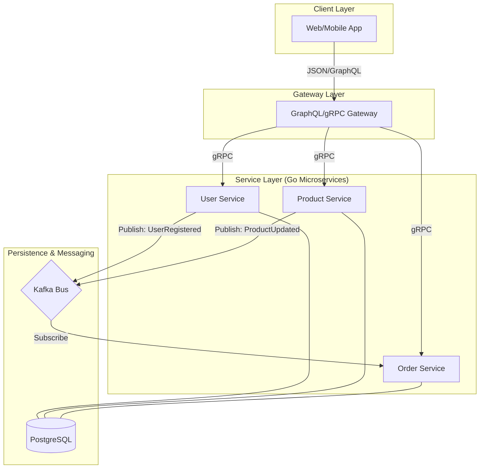

## Project HLD

```mermaid
graph TD
    subgraph "Client Layer"
        Web[Web/Mobile App]
    end
    subgraph "Gateway Layer"
        Gateway[GraphQL/gRPC Gateway]
    end
    subgraph "Service Layer (Go Microservices)"
        UserSvc[User Service]
        ProductSvc[Product Service]
        OrderSvc[Order Service]
    end
    subgraph "Persistence & Messaging"
        Postgres[(PostgreSQL)]
        Kafka{Kafka Bus}
    end

    Web -->|JSON/GraphQL| Gateway
    Gateway -->|gRPC| UserSvc
    Gateway -->|gRPC| ProductSvc
    Gateway -->|gRPC| OrderSvc

    UserSvc -->|Publish: UserRegistered| Kafka
    ProductSvc -->|Publish: ProductUpdated| Kafka
    Kafka -->|Subscribe| OrderSvc

    UserSvc --- Postgres
    ProductSvc --- Postgres
    OrderSvc --- Postgres
```